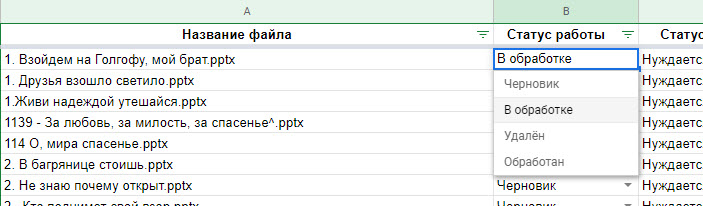

# Порядок взаимодействия между друг другом посредством Google-таблицы

## Адреса материалов, встречающихся в тексте:

- [Исходная папка с файлами](https://disk.yandex.ru/d/bHBqkWu96JfheQ).
- [Конечная папка с файлами](https://disk.yandex.ru/d/ReiOkqfXS3DXiw).
- [Инструкция по работе со слайдами](./slide_editing.md)
- [Рабочая google-таблица](https://docs.google.com/spreadsheets/d/1X98t5UnKPlcsj7Vc_KmZmoFBhndB0eH32p9lJVMdum4/edit#gid=0)

## Порядок работы

Для синхронизации действий тех, кто будет исправлять слайды создана специальная таблица со всеми именами файлов, которые
находятся в папке **Слайды**.

Рассмотрим порядок действий по исправлению слайда и оформлению работы, чтобы другие служители не делали ту же самую
работу, что и Вы:

1. Выбираем файл для редактирования
     
2. Смотрим его **Статус работы**.
    
   
     
   **Важно!** Необходимо брать работу со статусом **"Черновик"**. Это гарантирует, что никто другой не взял тот же самый
   файл в работу.
     
3. Меняем статус на **"В обработке"**
    
   
     
4. Теперь следует скачать выбранный файл к себе на компьютер из папки
   [Слайды](https://disk.yandex.ru/d/bHBqkWu96JfheQ)
   и любым удобным способом начать редактировать его по [инструкции](slide_editing.md)
     
   **Примечание:** Бывает такое, что файл не является текстом песни, тогда его не следует исправлять, но пометить
   статусом **"Удалён"**:
    
   
    
   Также следует помечать файлы статусом **Удалён**, которые являются дубликатами других песен.
     
5. После выполнения правок над файлом по [инструкции](slide_editing.md)
   необходимо загрузить обработанный файл в [папку](https://disk.yandex.ru/d/ReiOkqfXS3DXiw) облака.
    
   **Большая просьба: не менять файлы, уже находящиеся в папке!**
     
   Для загрузки в эту папку необходимо запросить доступ у Ильи в [ВК](https://vk.com/kuboork)
   или [Телеграмм](https://t.me/kuboork), предоставив почту, привязанную к аккаунту [Яндекса](https://yandex.ru)
     
6. После успешной загрузки исправленного файла в [папку](https://disk.yandex.ru/d/ReiOkqfXS3DXiw)
   необходимо установить статус **Обработан**, а также написать комментарий, что было сделано дополнительно (например,
   переименование файла):
    
   

**Примечание:** для удобства рекомендуется исправлять слайды по порядку, т.к. по мере исправления, файлы из
папки [Слайды](https://disk.yandex.ru/d/bHBqkWu96JfheQ) будут удаляться.

### 
Спасибо всем за участие!
