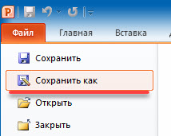
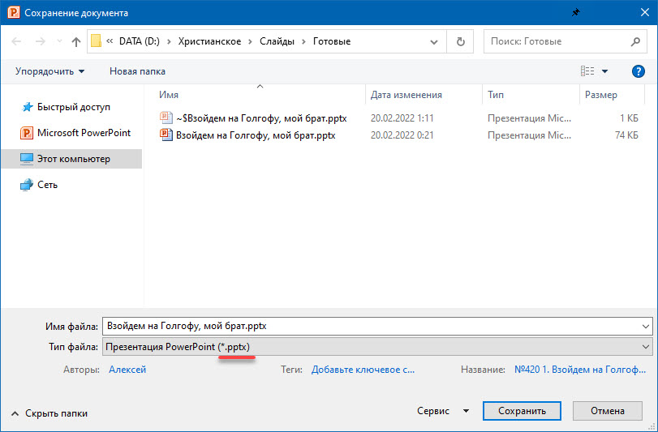
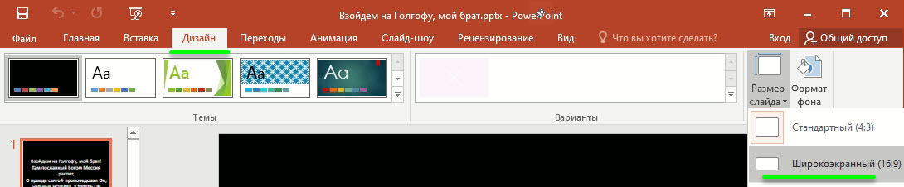
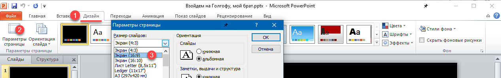
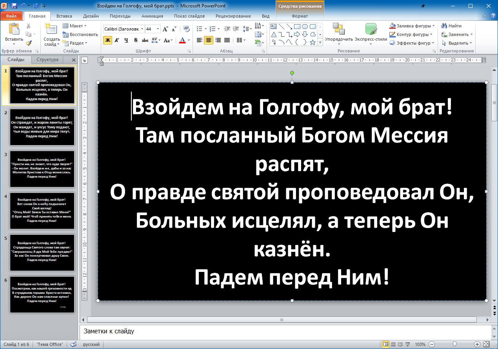
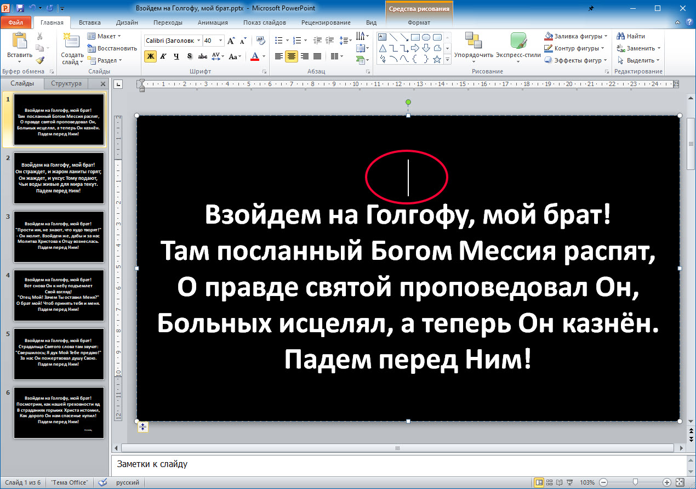
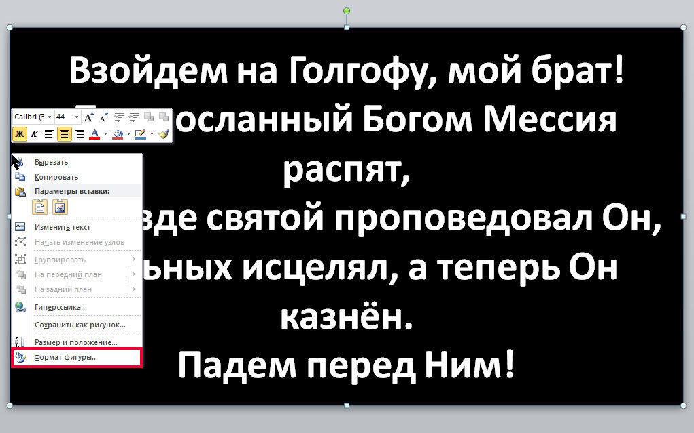
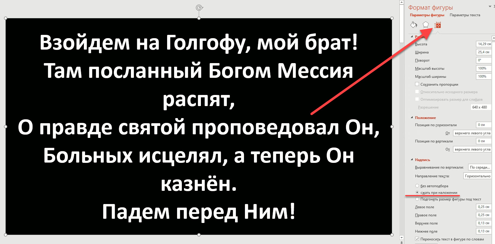
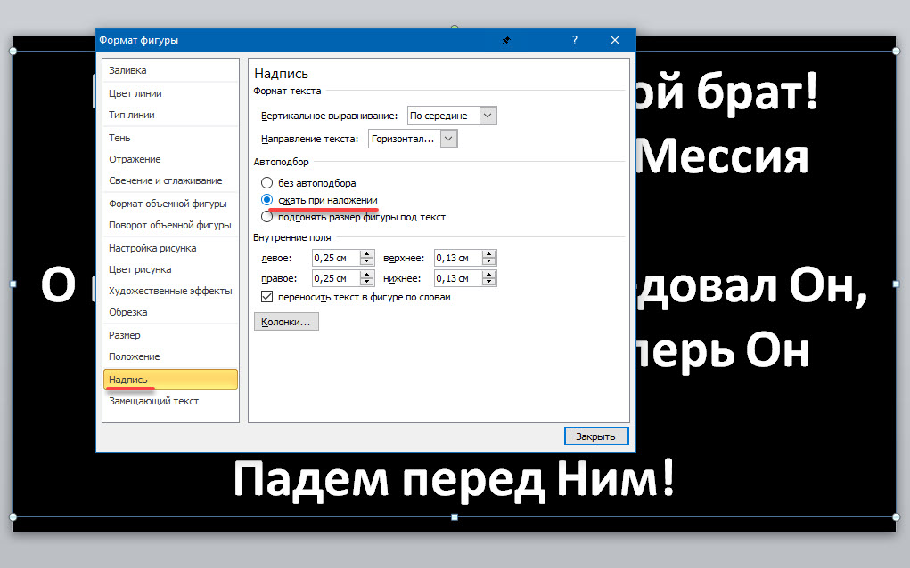

# Порядок исправления слайдов текста песни

1. Проверить и изменить название файла:
    - при сохранении (**Сохранить как...**) выбрать расширение ***.pptx**:
       
      
       
      
    - поменять называние файла, чтобы убрать цифры и другие символы;
    - если песня известна по словам куплета и припева либо есть какое то своё название (пример: **"Ода к радости"**), то
      лучше дополнительное название дописать в скобки:
        - **С ликованьем прославляем (Ода к радости).pptx**
    - название должно содержать полную 1 строчку куплета/припева во избежание неоднозначности:
        - **На далёком холме, средь деревьев и скал (Старый крест).pptx**
        - **На далёком холме старый крест виден мне (Старый крест).pptx**
            
2. Т.к. у нас телевизор формата **16:9**, то необходимо делать вывод текста без искажений:
    - Для **MS Office 2013** и выше:
       
      
    - Для **MS Office 2010**:
       
      
        
3. Затем необходимо растянуть область ввода текста на весь слайд:
    
   
     
   а также удалить лишние переносы строк, пробелы и другие элементы (как в начале текста слайда, так и в конце), не
   относящиеся к тексту песни:
    
   
     
   **Внимание!** Если область текста не растягивается, то необходимо настроить текстовое поле следующим образом:
    - Правой кнопкой мыши щёлкаем по краю текстового поля и выбираем **Формат фигуры...**
      
        
    - И устанавливаем значение автоподбора размера надписи в **сжать при наложении**:
        - Для **MS Office 2013** и выше:
           
          
        - Для **MS Office 2010**:
           
          
    - После чего надпись растянется на весь экран слайда
        
4. Последний слайд лучше выделять стилем **_жирный + курсив_** для понимания, когда надо заканчивать исполнение
     
5. После всех исправлений нужно проверить текст песни на ошибки (орфографические, пунктуационные и т.д.), при
   необходимости исправить (не забывать про букву `ё`, чтобы не терялась рифма песен), а также исправить неправильные
   переносы строк.
     
6. При выборе размера шрифта необходимо пользоваться принципом: "максимально заполнить пространство слайда текстом при
   минимальных переносах строк текста". Это значит, что нужно делать шрифт как можно больше, но чтобы не ухудшалось
   восприятие текста.

**Рекомендуемые параметры оформления текста:**

- **_цвет фона:_** `чёрный`
- **_цвет текста:_** `белый`
- **_шрифт:_** `Calibri`

Примеры оформления можно посмотреть в папке с уже исправленными слайдами.